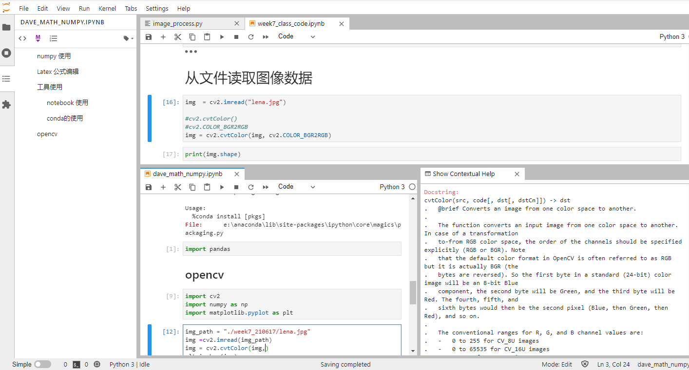
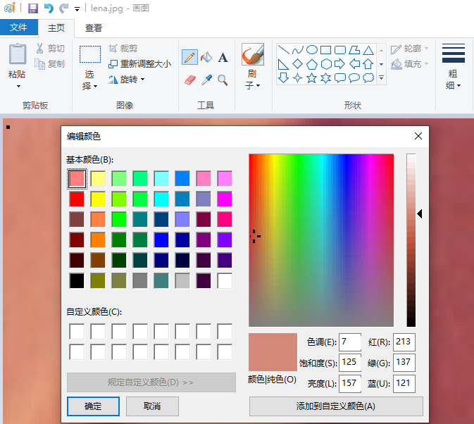
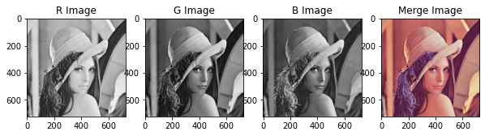
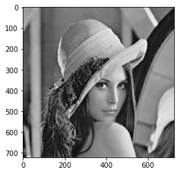
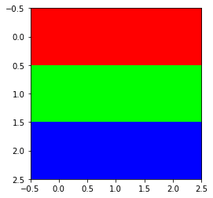
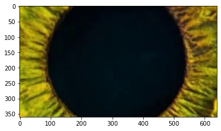

# [练气期]图像处理基础与OpenCV 如何修炼入门？

## 概述-元认知

### 练气期,我门需要掌握哪些知识?

掌握Opencv和图像处理的基础知识，并进行实践操作，具体包含：
1. 为什么选择Opencv，Opencv是什么？
2. 图像的基本概念是什么？
3. 图像的基本运算如何进行？
4. 色彩空间的类型转换如何进行
5. 图像的几何变换是什么？怎么操作？

### 人类与图像的认知

人类和高级动物等，与低级动物相比，一个非常重要的区别就是拥有眼睛，眼睛可以照见心灵，可以照见宇宙万物，亦可以照见"我相、人相、众生相、寿者相"，很大程度上，人因为眼睛产生图像而有了文字，有了文明，有了世代传承。古代就有很多民族产生过对眼睛的崇拜，比如三星堆中发现的古蜀人眼睛图腾。

因为眼睛，我们对世界产生了最重要的感知：图像。了解和学习图像知识，对我们自身的认知有非常大帮助。我们将世界对图像的感知能力赋予给汽车，实际上也希望汽车也能像人类一样”看见“。

## 环境安装与准备

opencv 在python环境下安装非常简单，一条命令即可:```pip install opencv-python ```。本文使用的是最新的python 3.8和Opencv 4。此外还需要最基本的科学计算包numpy，最常用的2D图像绘制包；

开发环境：notebook中，ipynb文件

```python
# notebook 环境中安装命令
#!pip install opencv-python
# 三个基础包
import cv2
import numpy as np
import matplotlib as plot
# 加一个%matplotlib inline在notebook中显示
%matplotlib inline
```

配置成功后,我喜欢的工作模式:



## 基本概念

### 为什么选择Opencv，Opencv是什么？

- why和what

OpenCV是一款非常优秀的开源计算机视觉库，是由Intel公司团队开发的，功能强大，并且可以在不同操作系统上运行，接口简洁高效，目前维护团队也依然活跃开发，他的底层是用C++/C来写的，和其他语言的接口也同样丰富。

opencv主要包含两个库：

Opencv主库，最常使用的，由Opencv的核心团队开发

Opencv贡献库，opencv_contrib库，由社区开发和维护，功能更全面，但是不是全部都是开源的。

### 图像的基本概念


- 图像的数学本质

  图像在数学本质上的表现，就是矩阵，每个坐标位置都表示图像中的一个像素点。在python中，矩阵的表示和计算方式，就是用numpy，所以numpy是图像处理的计算基础。
  
- 颜色空间

  颜色空间，又成为色彩空间、彩色空间、彩色模型、色彩模型等。包含彩色空间包含：RBG、Gray、HSV、XYZ色彩空间、HLS色彩空间等等，每种色彩空间都又自己擅长处理的领域，需要用到的时候转换即可。

- 通道 channel

  我们将每种单一颜色的数据，成为一种颜色通道。

- ROI 感兴趣区域

  ROI= Region of Interest，整个图像是一个空间域，ROI表示对图像总某一个空间Region感兴趣的地方。


## opencv 与python图像处理基础

OPencv的API使用，请参考[Opencv 官方手册](https://docs.opencv.org/4.5.3)

### 图像读写

#### 从图片中读取图像


```python
# 导入需要使用到的库
import cv2
import numpy as np
import matplotlib.pyplot as plt
%matplotlib inline
```


```python
# 读取图片，正确显示
img_path = "./week7_210617/lena.jpg"
# imread 默认flags =cv2.IMREAD_COLOR,即输出转成RGB通道的numpy数组
img =cv2.imread(img_path, cv2.IMREAD_COLOR)
img = cv2.cvtColor(img,cv2.COLOR_BGR2RGB)
plt.imshow(img)
```


    

```python
# 图像数组的常用属性
print("shape:",img.shape)
print("size:",img.size)
print("data type:",img.dtype)
# 获取0行0列，各通道数据的详情,0 表示黑色，
for i in range(3):
    print("array data detail:",img[0,0,i])
    # 使用item效率更高
    print("item data detail:",img.item(0,0,i))
```

    shape: (722, 726, 3)
    size: 1572516
    data type: uint8
    array data detail: 213
    item data detail: 213
    array data detail: 137
    item data detail: 137
    array data detail: 121
    item data detail: 121

画图工具，取到的第一个点的像素信息：



```python
# rgb 三颜色通道拆分和合并
r,g,b = cv2.split(img)
# 设置图显示区域的大小
plt.figure(figsize=(10,10))
plt.subplot(141)
plt.title("R Image")
plt.imshow(r,cmap="gray")
plt.subplot(142)
plt.title("G Image")
plt.imshow(g,cmap="gray")
plt.subplot(143)
plt.title("B Image")
plt.imshow(b,cmap="gray")
img_merge = cv2.merge([r,g,b])
plt.subplot(144)
plt.title("Merge Image")
plt.imshow(img_merge)
```



    

```python
# 转成灰度图像，并保存
img_gray = cv2.cvtColor(img,cv2.COLOR_RGB2GRAY)
plt.imshow(img_gray,cmap="gray")
# opencv 转灰度图的结果
print("opencv First gray Data:",img_gray[0,0])
# 彩色图像转灰度图像的结果
print("Calculate First Gray Data:",0.299* r[0,0] + 0.587 * g[0,0] + 0.114* b[0,0])
# 图像保存
cv2.imwrite("lena_gray.jpg",img_gray)
#plt.savefig("plt_lena_fig.jpg")
```

    opencv First gray Data: 158
    Calculate First Gray Data: 157.9


    

#### 利用数组构建图像

```python
# 通过numpy创建图像
img_np = np.array([[0,0,1],[0,1,0],[1,0,0]],np.uint8)
# plt显示图像，默认显示为彩色
plt.imshow(img_np,cmap="gray")
```


```python
img_arr = np.zeros((3,3,3),np.uint8)
#img_arr[:,:,] = 255

for i in range(3):
    for j in range(3):
        img_arr.itemset((i,j,i),255)
print(img_arr)
plt.imshow(img_arr)
```

    [[[255   0   0]
      [255   0   0]
      [255   0   0]]
    
     [[  0 255   0]
      [  0 255   0]
      [  0 255   0]]
    
     [[  0   0 255]
      [  0   0 255]
      [  0   0 255]]]



    


#### 从视频中读取图像


```python
# 加载视频，并读取图像
cap = cv2.VideoCapture("./week7_210617/How Computer Vision Works.mp4")
if cap.isOpened():
    # 读取第20帧的数据
    for i in range(20):
        ret,frame= cap.read()
plt.imshow(cv2.cvtColor(frame,cv2.COLOR_BGR2RGB))
```


  

```python
print(frame.shape)
cap.release()
```

    (360, 640, 3)


## 参考文献

1. 李立宗 《Opencv 轻松入门：面向Python》
2. 言有三，白身境 入门

