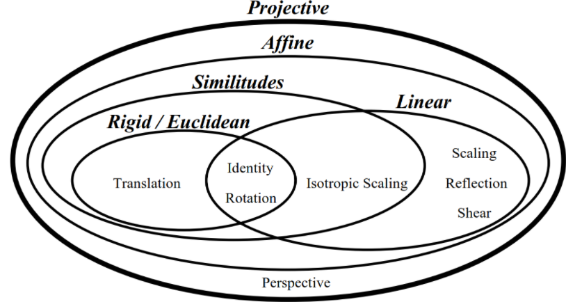
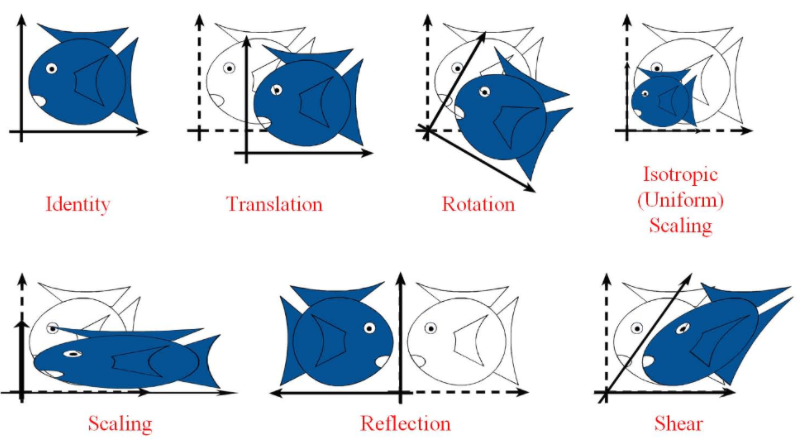

## [练气期]计算机视觉之图像几何变换修炼秘籍

### 练气期,我们需要掌握哪些图像处理知识?

掌握OpenCV和图像处理的基础知识，并进行实践操作，具体包含：

1. 为什么选择OpenCV，OpenCV是什么？
2. 图像的基本概念是什么？
3. 图像的基本运算如何进行？
4. 色彩空间的类型转换如何进行？
5. 图像的几何变换是什么？怎么操作？

本文讲解5部分，本质上就是图像**矩阵**在**几何坐标系**中，从一个坐标位置映射到另外一个坐标位置的**变换运算**。

#### 总体路线

我的知乎专栏：[自动驾驶之计算机视觉方向化神级修炼](https://www.zhihu.com/column/c_1407110076645273600)，可以看到练气期的完整修炼路径。

> 凡人修仙之练气期：
>
> 熟悉计算机视觉的基本概念，理解和使用常用的图像处理的方法；
> 自动驾驶的行业基本知识，自动驾驶行业基本组成、概念；
> 熟悉几种常用的传统机器学习方法，对深度学习的基本概念有了解；
> 有一定的数学基础，较好的编程基础，掌握常用的数据结构和算法（身体条件好）；
> 有基本秘籍在手，开始进行前几层的修炼，对修炼有了入门的认识。
>
> 对应公司职级：助理工程师 阿里 P3/P4，华为13/14

## 基本概念

### 图像几何变换 Geometry transform 

就是图像**矩阵**在**几何坐标系**中，从一个坐标位置映射到另外一个坐标位置的**变换运算**。具体的变换方法包含平移、镜像、缩放、旋转、仿射变换、透视、重映射等。

各个几何变换的关系（参考[仿射变换及其变换矩阵的理解](https://www.cnblogs.com/shine-lee/p/10950963.html)）如下图，仿射变换包含缩放、平移、旋转、剪切变形（shear）等，透视变换包括仿射变换。

仿射变换包括如下所有变换，以及这些变换任意次序次数的组合：

- 刚体变换 

  旋转（Rotation）和平移(Translation) 又称为刚体变换，图像不会发生形变。

- 剪切变换

  所有点沿着某一方向成比例平移的变换。

### 线性代数的基本概念

理解线性代数的基本概念是理解图像几何变换的基础，也是后续所有更高层次课程的基础，所以这部分我们需要花时间去理解和掌握。

- 线性变换

  

## 图像几何变换实践修炼

### 图像的平移

## 参考文献

1. 李立宗 《Opencv 轻松入门：面向Python》
2. 言有三，白身境 入门

#### 致谢

致敬伟大的老师，如中国的孔子、西方的亚里士多德等，他们为后人教育付出了非常大的心血，同时为人类文明的进步做出巨大的贡献。如今高人辈出的年代，我作为一名普通的技术工作者，亦追求前辈的教诲，瞄准目标，坚定道路前进：**凡人欲学一事，必先见明道理，立定脚跟，一眼看定，一手拿定，不做到急处不休**。

## Dave的专栏 -自动驾驶之计算机视觉修炼系列

欢迎道友讨论交流，前辈传授经验。

- Dave知乎专栏：[自动驾驶之计算机视觉方向化神级修炼](https://www.zhihu.com/column/c_1407110076645273600)
- [Dave的Github仓库](https://github.com/sunrong1/self-driving)

