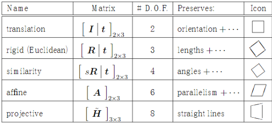
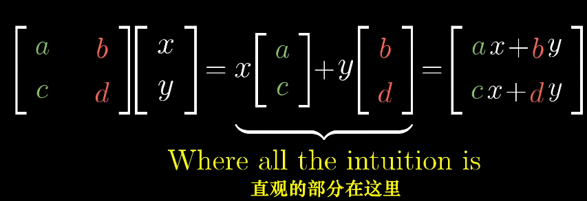
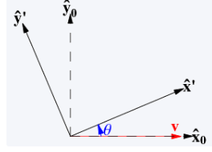
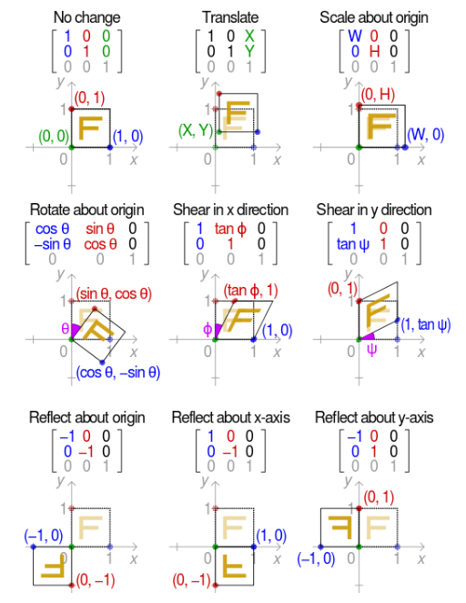
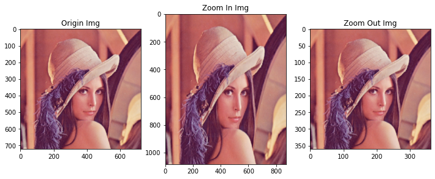
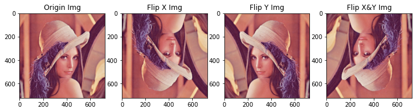
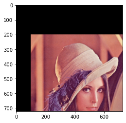
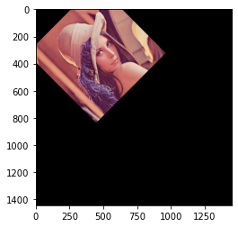
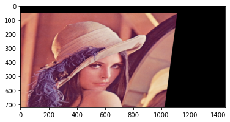

## [练气期]计算机视觉之从矩阵本质修炼图像几何变换秘籍

### 练气期,我们需要掌握哪些图像处理知识?

掌握OpenCV和图像处理的基础知识，并进行实践操作，具体包含：

1. 为什么选择OpenCV，OpenCV是什么
2. 图像处理的基本概念
3. 图像处理的基本运算
4. 色彩空间的类型转换
5. 图像的几何变换原理，可以实现的效果
6. 图像的滤波的基本原理，各种滤波转换实现的效果
7. 图像的直方图处理和图像增强；
8. OpenCV实践补充：OpenCV图像的绘制、图像金字塔；

本文讲解5部分，本质上就是图像**矩阵**在**几何坐标系**中，从一个坐标位置映射到另外一个坐标位置的**变换运算**。

#### 总体路线

我的知乎专栏：[自动驾驶之计算机视觉方向化神级修炼](https://www.zhihu.com/column/c_1407110076645273600)，可以看到计算机视觉的完整修炼路径。

> 凡人修仙之练气期：
>
> 熟悉计算机视觉的基本概念，理解和使用常用的图像处理的方法；
> 自动驾驶的行业基本知识，自动驾驶行业基本组成、概念；
> 熟悉几种常用的传统机器学习方法，对深度学习的基本概念有了解；
> 有一定的数学基础，较好的编程基础，掌握常用的数据结构和算法（身体条件好）；
> 有基本秘籍在手，开始进行前几层的修炼，对修炼有了入门的认识。
>
> 对应公司职级：助理工程师 阿里 P3/P4，华为13/14


## 基本概念

### 图像几何变换 Geometry transform 

就是图像**矩阵**在**几何坐标系**中，从一个坐标位置映射到另外一个坐标位置的**变换运算**。具体的变换方法包含平移、镜像、缩放、旋转、仿射变换、透视、重映射等。

各个几何变换的关系（参考[仿射变换及其变换矩阵的理解](https://www.cnblogs.com/shine-lee/p/10950963.html)）如下图，仿射变换包含缩放、平移、旋转、剪切变形（shear）等，透视变换包括仿射变换。


仿射变换包括如下所有变换，以及这些变换任意次序次数的组合：


- 刚体变换 

  旋转（Rotation）和平移(Translation) 又称为刚体变换，图像不会发生形变。

- 剪切变换 Shear （倾斜）

  所有点沿着某一方向成比例平移的变换。

#### 图像插值

图像几何空间变换，就会涉及像素点的移动，移动后的像素点变多、或者移动的位置是非整数时，就要用到插值计算。缩小图像，一般使用**区域插值(Inter Area)**方法，放大图像时，一般会用**双线性插值（Inter linear）**或者**三线性插值(Inter Cubic)**算法实现。下面表格是OpenCV支持的几种常用的插值方法：

| interpolation  选项 | 所用的插值方法                                               |
| ------------------- | ------------------------------------------------------------ |
| INTER_NEAREST       | 最近邻插值                                                   |
| INTER_LINEAR        | 双线性插值（默认设置）                                       |
| INTER_AREA          | 使用像素区域关系进行重采样。 它可能是图像抽取的首选方法，因为它会产生无云纹理的结果。 但是当图像缩放时，它类似于INTER_NEAREST方法。 |
| INTER_CUBIC         | 4x4像素邻域的双三次插值                                      |
| INTER_LANCZOS4      | 8x8像素邻域的Lanczos插值                                     |

#### 仿射变换

图像W = 变换矩阵M X 原始图像O

仿射变换本质是图像几何坐标系的矩阵变换，仿射变换后图像的平值性和平行性保持不变。变换矩阵是2*3的大小。

仿射的变换的变换矩阵如下，由6个自由度：
$$
%移位操作
M = \left[
 \begin{matrix}
   a & b & t_x \newline
   c & d & t_y 
  \end{matrix}
  \right]
$$
不同的变换矩阵实现的效果：



### 线性代数的基本概念

理解线性代数的基本概念是理解图像几何变换的基础，也是后续所有更高层次课程的基础，所以这部分我们需要花时间去理解和掌握。可以参考强大的[B站 线性代数的本质 ](https://www.bilibili.com/video/BV1ys411472E?p=4) 。

#### 线性变换 linear transformation

几何中一种简单的变换方式，然而功能却非常强大。必须满足两个性质：

1. 直线变换后还是直线，不能弯曲；
2. 原点必须保持不变，不能平移；

#### 基本概念

- 线性变换

  线性变换是操作空间的一种手段，原点保持不变，直线保持直线，平行线保持平行。线性变换可以使用非常简洁矩阵表示，二位的线性变换，仅需使用四个数字表示。

- 向量 vector

  可以看作有序的数字列表。在向量空间中，是以原点为出发指向向量的终点。在线性代数中，一般使用列向量表示。向量将空间的运动进行了表示。

- 基向量 basis vector

  线性空间中的一个向量2i +5j，可以表示为`$\vec{v}$`:
  $$
  \vec{v}= 2 \vec{i} + 5\vec{j}=
  \begin{pmatrix}
  2 \\
  5
  \end{pmatrix}
  = 
  \begin{pmatrix}
  2 & 0\\
  0 & 5 
  \end{pmatrix}
  \begin{pmatrix}
  i\\
  j 
  \end{pmatrix}
  $$

- 矩阵向量乘法运算

  矩阵向量乘法运算，本质就是计算线性变换作用于给定向量的一种途径，如下图。




- 线性相关 Linearly Dependent

  其中的一个向量可以表示为其他向量的线性组合，就说他们是线性相关的。否则就成为线性无关的。线性相关的向量对扩大张成的空间没有帮助。

#### 仿射矩阵

仿射矩阵M是2* 3的结构。其中，m和n向量表示的是新的基向量，o向量表示的是新的坐标原点的位置。
$$
M =
\begin{pmatrix}  
    a & b & t_x \newline  
    c & d & t_y   
\end{pmatrix}
= \left(\vec{m},\vec{n},\vec{o}\right)
$$
举个旋转的例子，下图是一个二维的坐标系，假设空间中一个向量(x,y)向做旋转一个角度，则新的坐标位置(x',y')在什么地方？：



当坐标内的点旋转，实际上就可以等效为坐标系的旋转，使用新的坐标基向量表示真个坐标系：
$$
\begin{pmatrix}  
   x' \newline  
    y'   
\end{pmatrix}
=x
\begin{pmatrix}  
    \cos\theta \newline  
   \sin \theta   
\end{pmatrix}
+y
\begin{pmatrix}  
    -\sin \theta \newline  
   \cos \theta   
\end{pmatrix}
=
\begin{pmatrix}  
   \cos\theta &-\sin\theta \newline  
   \sin\theta & \cos\theta   
\end{pmatrix}
\begin{pmatrix}  
    x \newline  
    y   
\end{pmatrix}
$$
所有的变换矩阵都是基向量和原点的变换。

各种变换的矩阵对应关系，就很容易推导了：



## 图像几何变换实践修炼

### 图像缩放


```python
# 导入需要使用到的库
import cv2
import numpy as np
import matplotlib.pyplot as plt
%matplotlib inline
```


```python
# 读取图片，正确显示
img_path = "./week7_210617/lena.jpg"
# imread 默认flags =cv2.IMREAD_COLOR,即输出转成RGB通道的numpy数组
img =cv2.imread(img_path, cv2.IMREAD_COLOR)
img = cv2.cvtColor(img,cv2.COLOR_BGR2RGB)
plt.imshow(img)
row,col,channel = img.shape
print(img.shape)
```

```json
(722, 726, 3)
```


    

图片的缩小和放大，输入的数据类型必须是ints,同时注意dsize的顺序，是（col,row）列在前
下面使用了resize函数的两种不同使用方法


```python
# 放大
img_big = cv2.resize(img,((int)(col*1.2),(int)(row*1.5)),cv2.INTER_CUBIC)
plt.figure(figsize=(12,12))
plt.subplot(131)
plt.title("Origin Img")
plt.imshow(img)
plt.subplot(132)
plt.title("Zoom In Img")
plt.imshow(img_big)
print(img_big.shape)
# 图像缩小
#img_small = cv2.resize(img,dsize=None,fx = 0.5,fy=0.5,interpolation= cv2.INTER_AREA)
img_small = cv2.resize(img,None,fx= 0.5,fy=0.5)
plt.subplot(133)
plt.title("Zoom Out Img")
plt.imshow(img_small)
print(img_small.shape)
```

图像的尺寸变换：

```json
(1083, 871, 3)
(361, 363, 3)
```



    


### 图像反转

反转函数flip比较简单，又三种情况，绕x、y轴分别旋转和同时绕x,y轴旋转


```python
# x轴旋转
img_flip_x = cv2.flip(img,0)
plt.figure(figsize=(12,12))
plt.subplot(141)
plt.title("Origin Img")
plt.imshow(img)
plt.subplot(142)
plt.title("Flip X Img")
plt.imshow(img_flip_x)
# Y轴旋转
img_flip_y = cv2.flip(img,1)
plt.subplot(143)
plt.title("Flip Y Img")
plt.imshow(img_flip_y)
# 同时绕X Y轴旋转
img_flip_xy = cv2.flip(img,-1)
plt.subplot(144)
plt.title("Flip X&Y Img")
plt.imshow(img_flip_xy)
```



    


### 仿射变换

仿射变换可以实现一系列的几何变换，包含平移、旋转等。
仿射变换图像W = 变换矩阵M X 原始图像O
OpenCV中通过warpAffine函数实现。

1. 矩阵平移M

   注意M矩阵中的元素只能是浮动型


```python
# 仿射矩阵M，X轴移动1100个像素，Y移动200个像素
M = np.float32([[1,0,100],[0,1,200]])
img_trans= cv2.warpAffine(img,M,(col,row))
plt.imshow(img_trans)
```




2. 旋转
   旋转矩阵M比较难获取，可以通过辅助函数cv2.getRotationMatrix2D获取。


```python
# 设置旋转的中心点，角度，和所处的缩放比例
M = cv2.getRotationMatrix2D((row/2,col/3),45,1)
print(M)
img_rotation = cv2.warpAffine(img,M,(col*2,row*2))
plt.imshow(img_rotation)
```

仿射矩阵：

```json
[[  0.70710678   0.70710678 -65.38538906]
 [ -0.70710678   0.70710678 326.14570696]]
```




3.  更复杂的仿射变换

更一般的仿射变换，可以通过目标图像中的三个坐标点确定仿射矩阵。三个不在一条直线上的点，可以确定一个平面。
通过getAffineTransform函数获得转换矩阵


```python
pts1 = np.float32([[50,50],[200,50],[50,200]])
pts2 = np.float32([[70,100],[300,100],[50,250]])
M = cv2.getAffineTransform(pts1,pts2)
print(M)
dst = cv2.warpAffine(img,M,(col*2,row))
plt.imshow(dst)
```

仿射矩阵：

```json
[[ 1.53333333e+00 -1.33333333e-01  0.00000000e+00]
 [-7.10542736e-17  1.00000000e+00  5.00000000e+01]]
```





## 参考文献

1. 李立宗 《Opencv 轻松入门：面向Python》
2. 言有三，白身境 入门
3. [仿射变换及其变换矩阵的理解](https://www.cnblogs.com/shine-lee/p/10950963.html)

## 致谢

致敬伟大的老师，如中国的孔子、西方的亚里士多德等，他们为后人教育付出了非常大的心血，同时为人类文明的进步做出巨大的贡献。如今高人辈出的年代，我作为一名普通的技术工作者，亦追求前辈的教诲，瞄准目标，坚定道路前进：**凡人欲学一事，必先见明道理，立定脚跟，一眼看定，一手拿定，不做到急处不休**。

## Dave的专栏 -自动驾驶之计算机视觉修炼系列

欢迎道友讨论交流，前辈传授经验。

- Dave知乎专栏：[自动驾驶之计算机视觉方向化神级修炼](https://www.zhihu.com/column/c_1407110076645273600)
- [Dave的Github仓库](https://github.com/sunrong1/self-driving)


