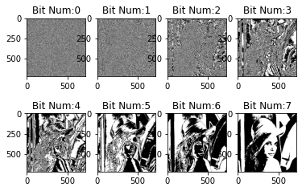

# [练气期]计算机视觉之图像基本运算和颜色空间变换修炼秘籍

## 概述-元认知

### 练气期,我们需要掌握哪些图像处理知识?

掌握Opencv和图像处理的基础知识，并进行实践操作，具体包含：

1. 为什么选择Opencv，Opencv是什么？
2. 图像的基本概念是什么？
3. 图像的基本运算如何进行？
4. 色彩空间的类型转换如何进行？
5. 图像的几何变换是什么？怎么操作？

本文讲解3,4部分，本质上就是图像矩阵加运算、位运算操作；色彩的不同属性描述方式。

## 基本概念

### 图像运算

图像的运算，本质上对像素数值的元素，包括加法、位运算等，不同的运算展现了不同的特性，在图像的实际应用中，也表现出不同的效果。

- 矩阵运算

  矩阵和，加权和运算等；两个图像做**矩阵和**运算，可以获得虚影的效果。

- 像素的位运算

  包括**与或非**、**异或**等操作，比如图像的异或运算，可以对图像加密，对图像像素的某一位（比如其中一个Bit位）位替换一个图像，可以产生水印的效果

- 图像掩码 MASK

  这个是借鉴的PCB制作领域的概念，掩码的BIT位数学表示就只有两种，一种是全0，一种是包含1（注意是包含），故掩码的作用就只有两个，一个是覆盖不需要处理的区域，另外一个就是暴露需要处理的区域。

- 图像位平面

  将图像中的像素点的数字转成二进制，比如10000001(128)，将所有二进制数值上的每一位进行组合，就会获得一副二值图像（8bit的灰度图像就是8副图像），这个二值图像就是该图像的位平面。

  从概率论和权重角度来说，高有效位组成的二值图像和原图最接近。
  
- 图像阈值处理

  指剔除图像内像素高于一定值或者低于一定值的像素点。OpenCV中使用`cv2.threadhold()`函数进行阈值化处理。

### 颜色空间	

颜色空间，又成为色彩空间、彩色空间、彩色模型、色彩模型等。包含彩色空间包含：RGB、Gray、HSV、XYZ色彩空间、HLS色彩空间等等，每种色彩空间都又自己擅长处理的领域，需要用到的时候转换即可。

- RGB 颜色空间

  我们接触最多的颜色空间，简单而且容易理解，我们日常使用的手机电脑，都是以整个颜色模型进行显示的，电子化实现最简单。但是RGB模型的展示的总体颜色是和三个通道同时相关的，颜色非线性变化，和人的视觉感觉不匹配。

  

- HSV颜色空间

  （Hue-色调、Saturation-饱和度、Value-值）这个是我们图像处理中常借助的颜色空间，可以和人的直观经验比较匹配，方便我们对颜色的处理，颜色分割。我们可以从一种纯色彩开始，即指定色彩角H，并让V=S=1，然后我们可以通过向其中加入黑色和白色来得到我们需要的颜色。增加黑色可以减小V而S不变，同样增加白色可以减小S而V不变。
  
  - 色调　HUE,定义V=S=1时候的颜色；
  - 饱和度 Saturation,就是向颜色中增加白色，极度不饱和就是白色；
  - 亮度 Value；亮度极低就是黑色，就是在图像中添加黑色；


- HLS颜色空间

  hue（色相）、saturation（饱和度）、lightness（亮度）。HLS 和 HSV 非常类似，只是亮度的分量不同。HLS 中的 L 分量为亮度，亮度为100，表示白色，亮度为0，表示黑色；HSV 中的 V 分量为明度，明度为100，表示光谱色，明度为0，表示黑色。提取白色物体时，使用 HLS 更方便。

  


## 图像基本运算和颜色空间变换实践修炼

### 图像的基本运算操作


```python
# 导入所需的python库
import cv2
import numpy as np
import matplotlib.pyplot as plt
%matplotlib inline
```


```python
# 读入待处理的图像
img_bgr = cv2.imread("./week7_210617/lena.jpg")
img = cv2.cvtColor(img_bgr,cv2.COLOR_BGR2RGB)
plt.imshow(img)
print(img.shape)
```

    (722, 726, 3)


#### 矩阵和运算


```python
# 矩阵和运算
print("原始数据：",img[0:2,0,0])
temp = img + 100
print("Result(img + 100) :" , temp[0:2,0,0])
plt.figure(figsize=(12,12))
plt.subplot(131)
plt.title("IMG + 100")
plt.imshow(temp)

#CV2的矩阵和运算
temp_cv = cv2.add(img,100)
print("Result(cv2(img + 100) :" , temp_cv[0:2,0,0])
plt.subplot(132)
plt.title("cv2(IMG + 100)")
plt.imshow(temp_cv)
# 原始图
plt.subplot(133)
plt.title("IMG Origin)")
plt.imshow(img)
```
返回值
```python
原始数据： [213 212]
Result(img + 100) : [57 56]
Result(cv2(img + 100) : [255 255]
```


#### 矩阵权重运算,给图片增加水印
这种方式的水印不容易提取,后面按照位平面增加水印的方式很容易提取


```python
watermask = cv2.imread("./dog.png",0)
row,col = img_gray.shape
wm = cv2.resize(watermask,(col,row))
print(wm.shape)
print(img_gray.shape)
plt.figure(figsize=(12,12))
plt.subplot(121)
plt.title("watermask img")
plt.imshow(watermask,cmap="gray")
plt.subplot(122)
plt.title("watermask Result")
plt.imshow(cv2.addWeighted(img_gray,0.9,wm,0.1,0),cmap="gray")
```
返回值:

(722, 726)
(722, 726)


    


### 逻辑运算

#### 位平面运算


```python
# 逻辑运算之位平面
img_gray = cv2.cvtColor(img,cv2.COLOR_RGB2GRAY)
plt.figure()
plt.title("Origin Gray Image")
plt.imshow(img_gray,cmap="gray")
#获取图像的行列信息
row,col = img_gray.shape
mask = np.zeros((row,col,8),np.uint8)
for i in range(8):
    mask[:,:,i] =2**i
print(mask.shape)
plt.figure()
result = np.zeros((row,col,8),np.uint8)
for i in range(8):
    result[:,:,i] = cv2.bitwise_and(img_gray,mask[:,:,i])
    plt.subplot(2,4,i+1)
    plt.title("Bit Num:" + str(i))
    plt.imshow(result[:,:,i],"gray")
```

返回结果：
(722, 726, 8)




```python
# numpy bool索引掩码处理图像
temp =result[:,:,0] > 0
result[temp] =255
print(result[:,:,0])
plt.imshow(result[:,:,0],cmap="gray")
```
返回值:
```python
    [[  0   0 255 ...   0   0 255]
     [255   0 255 ... 255 255   0]
     [255 255 255 ...   0 255 255]
     ...
     [  0 255   0 ...   0   0   0]
     [  0 255   0 ...   0   0   0]
     [  0 255   0 ... 255   0 255]]
```


    


#### 异或运算-实现图像加密和解密


```python
# 异或运算，对称加密图像
# 加密的key和原图尺寸相同，可以随机生成一个密钥
row,col = img_gray.shape
key = np.random.randint(0,256,size=(row,col),dtype = np.uint8)
print("encryption key:",key)
img_encryption = cv2.bitwise_xor(img_gray,key)
plt.figure(figsize=(12,12))
plt.subplot(141)
plt.title("Origin Img")
plt.imshow(img_gray,cmap="gray")
plt.subplot(142)
plt.title("Encryption Key Img")
plt.imshow(img_encryption,cmap="gray")

img_decryption= cv2.bitwise_xor(img_encryption,key)
plt.subplot(143)
plt.title("Reback Img")
plt.imshow(img_decryption,cmap="gray")
```
返回值:
```python
    encryption key: [[ 19 215 128 ... 206  52 232]
     [  6 205 127 ... 186 139  70]
     [ 16 217 190 ...  86 168 238]
     ...
     [ 11  87  56 ... 218 191 198]
     [176 127  43 ...  52 178  56]
     [240 222 211 ...  70 225  83]]
```


    


#### 最低有效位修改- 增加图片数字水印(综合练习)

位平面替换增加数字水印
可以实现信息隐藏\版权认证\身份认证等功能


```python
# 生成水印图
wm = np.eye(722,726,dtype=np.uint8)
plt.figure(figsize=(12,12))
plt.subplot(142)
plt.title("2-value wartermask")
plt.imshow(wm,cmap="gray")
print(wm*255)
# 提取待处理图像的高7位,最低位设置成0
mask254= np.ones((row,col),np.uint8) * 254
img_high7 = cv2.bitwise_and(img_gray,mask254)
# 嵌入水印
img_with_watermask = cv2.bitwise_or(img_high7,wm)
plt.subplot(143)
plt.title("img_with_watermask")
plt.imshow(img_with_watermask,cmap="gray")
mask1 = np.ones((row,col),np.uint8)
cal_watermask = cv2.bitwise_and(img_with_watermask,mask1)
plt.subplot(144)
plt.title("cal_watermask")
plt.imshow(cal_watermask,cmap="gray")
print(cal_watermask)
```
返回值
```python
    [[255   0   0 ...   0   0   0]
      [  0 255   0 ...   0   0   0]
      [  0   0 255 ...   0   0   0]
      ...
      [  0   0   0 ...   0   0   0]
      [  0   0   0 ...   0   0   0]
      [  0   0   0 ...   0   0   0]]
    [[1 0 0 ... 0 0 0]
      [0 1 0 ... 0 0 0]
      [0 0 1 ... 0 0 0]
      ...
      [0 0 0 ... 0 0 0]
      [0 0 0 ... 0 0 0]
      [0 0 0 ... 0 0 0]]
```


    


### HSV 色彩空间

#### RGB转成HSV


```python
import cv2
img_bgr= cv2.imread('./week7_210617/lena.jpg')
img= cv2.cvtColor(img_bgr,cv2.COLOR_BGR2RGB)
img_hsv = cv2.cvtColor(img_bgr,cv2.COLOR_BGR2HSV)
plt.imshow(img_hsv)
```


    


#### HSV进行肤色分割

位运算方法


```python
h,s,v = cv2.split(img_hsv)
hue_min= 0
hue_max = 20
hue_mask = cv2.inRange(h,hue_min,hue_max)
plt.imshow(hue_mask)
sat_min =80
sat_max =255
sat_mask = cv2.inRange(s,sat_min,sat_max)
mask= hue_mask & sat_mask
roi = cv2.bitwise_and(img,img,mask=mask)
plt.imshow(roi)
```


    


阈值处理方法
从结果上看，两者的结果相同


```python
# 遍历图像, 判断HSV通道的数值, 如果在指定范围中, 则置把新图像的点设为255,否则设为0
row,col,channel = img.shape
for i in  range(0, row):
    for j in  range(0, col):
        if (h[i][j] >  0) and (h[i][j] <  20) and (s[i][j] >  100) and (s[i][j] <255) and (v[i][j]>100) and (v[i][j] <255):
            pass
        else:
            img[i][j] =  0
        
plt.imshow(img)
```


## 参考文献

1. 李立宗 《Opencv 轻松入门：面向Python》
2. 言有三，白身境 入门

#### 致谢

致敬敬业的乡村教师，相比于培养伟大的灵魂，给予无私的爱和关怀，所教育的知识仅仅是一个打开大门的钥匙，认识海洋无界，每个人都应又自己的体验和感悟．

## Dave的专栏 -自动驾驶之计算机视觉修炼系列

有疑问或者不对的地方，欢迎道友讨论交流，前辈传授经验。

- Dave知乎专栏：[自动驾驶之计算机视觉方向化神级修炼](https://www.zhihu.com/column/c_1407110076645273600)
- [Dave专栏Github](https://github.com/sunrong1/self-driving)


