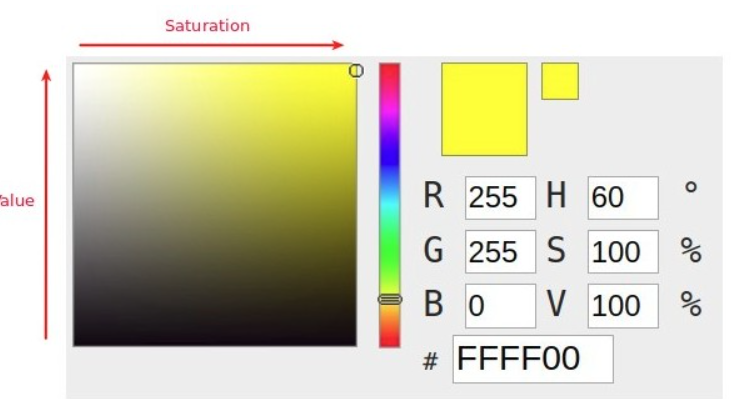

# [练气期]计算机视觉之图像基本运算和颜色空间变换如何快速修炼掌握？

## 概述-元认知

### 练气期,我们需要掌握哪些图像处理知识?

掌握Opencv和图像处理的基础知识，并进行实践操作，具体包含：

1. 为什么选择Opencv，Opencv是什么？
2. 图像的基本概念是什么？
3. 图像的基本运算如何进行？
4. 色彩空间的类型转换如何进行？
5. 图像的几何变换是什么？怎么操作？

本文讲解3,4部分，本质上就是图像矩阵加运算、位运算操作；色彩的不同属性描述方式。

## 基本概念

### 图像运算

图像的运算，本质上对像素数值的元素，包括加法、位运算等，不同的运算展现了不同的特性，在图像的实际应用中，也表现出不同的效果。

- 矩阵运算

  矩阵和，加权和运算等；两个图像做**矩阵和**运算，可以获得虚影的效果。

- 像素的位运算

  包括**与或非**、**异或**等操作，比如图像的异或运算，可以对图像加密，对图像像素的某一位（比如其中一个Bit位）位替换一个图像，可以产生水印的效果

- 图像掩码 MASK

  这个是借鉴的PCB制作领域的概念，掩码的BIT位数学表示就只有两种，一种是全0，一种是包含1（注意是包含），故掩码的作用就只有两个，一个是覆盖不需要处理的区域，另外一个就是暴露需要处理的区域。

- 图像位平面

  将图像中的像素点的数字转成二进制，比如10000001(128)，将所有二进制数值上的每一位进行组合，就会获得一副二值图像（8bit的灰度图像就是8副图像），这个二值图像就是该图像的位平面。

  从概率论和权重角度来说，高有效位组成的二值图像和原图最接近。
  
- 图像阈值处理

  指剔除图像内像素高于一定值或者低于一定值的像素点。OpenCV中使用`cv2.threadhold()`函数进行阈值化处理。

### 颜色空间	

颜色空间，又成为色彩空间、彩色空间、彩色模型、色彩模型等。包含彩色空间包含：RGB、Gray、HSV、XYZ色彩空间、HLS色彩空间等等，每种色彩空间都又自己擅长处理的领域，需要用到的时候转换即可。

- RGB 颜色空间

  我们接触最多的颜色空间，简单而且容易理解，我们日常使用的手机电脑，都是以整个颜色模型进行显示的，电子化实现最简单。但是RGB模型的展示的总体颜色是和三个通道同时相关的，颜色非线性变化，和人的视觉感觉不匹配。

  

- HSV颜色空间

  （Hue-色调、Saturation-饱和度、Value-值）这个是我们图像处理中常借助的颜色空间，可以和人的直观经验比较匹配，方便我们对颜色的处理，颜色分割。我们可以从一种纯色彩开始，即指定色彩角H，并让V=S=1，然后我们可以通过向其中加入黑色和白色来得到我们需要的颜色。增加黑色可以减小V而S不变，同样增加白色可以减小S而V不变。
  
  - 色调　HUE,定义V=S=1时候的颜色；
  - 饱和度 Saturation,就是向颜色中增加白色，极度不饱和就是白色；
  - 亮度 Value；亮度极低就是黑色，就是在图像中添加黑色；

## 图像基本运算和颜色空间变换实践修炼

### 图像的基本运算操作

## 参考文献

1. 李立宗 《Opencv 轻松入门：面向Python》
2. 言有三，白身境 入门

#### 致谢

致敬敬业的乡村教师，相比于培养伟大的灵魂，给予无私的爱和关怀，所教育的知识仅仅是一个打开大门的钥匙，认识海洋无界，每个人都应又自己的体验和感悟．

## Dave的专栏

有疑问或者不对的地方，欢迎道友讨论交流，前辈传授经验。

- Dave知乎专栏：[自动驾驶之计算机视觉方向化神级修炼](https://www.zhihu.com/column/c_1407110076645273600)
- [Dave专栏Github](https://github.com/sunrong1/self-driving)

