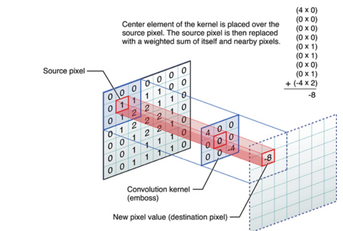
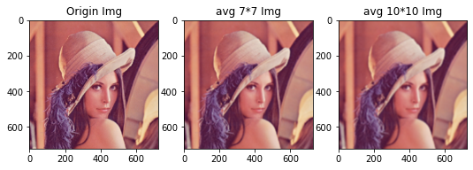
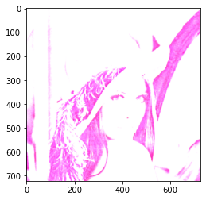
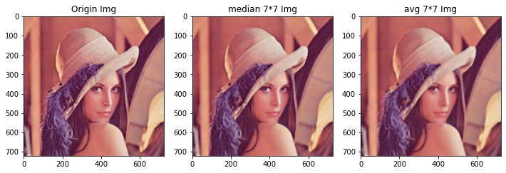
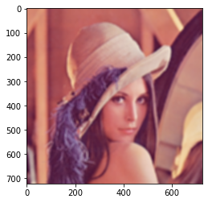
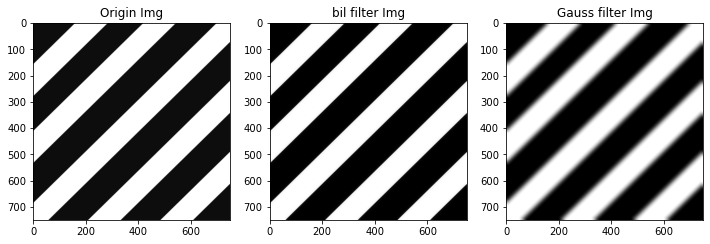

# [练气期]计算机视觉之图像滤波平滑处理实践修炼

### 练气期,我们需要掌握哪些图像处理知识?

掌握OpenCV和图像处理的基础知识，并进行实践操作，具体包含：

1. 为什么选择OpenCV，OpenCV是什么
2. 图像处理的基本概念
3. 图像处理的基本运算
4. 色彩空间的类型转换
5. 图像的几何变换原理，可以实现的效果
6. 图像的滤波的基本原理，各种滤波转换实现的效果
7. 图像的直方图处理和图像增强；
8. OpenCV实践补充：OpenCV图像的绘制、图像金字塔；

本文讲解计算机视觉练气期最后半部分，图像的滤波操作，因为图像滤波（Image filtering）能够产生模糊和平滑的效果，因此也被成为图像模糊（Image Blurring），或者图像平滑（Image Smoothing）。

#### 总体路线

我的知乎专栏：[自动驾驶之计算机视觉方向化神级修炼](https://www.zhihu.com/column/c_1407110076645273600)，可以看到计算机视觉的完整修炼路径。

> 凡人修仙之练气期：
>
> 熟悉计算机视觉的基本概念，理解和使用常用的图像处理方法；
> 自动驾驶的行业基本知识，自动驾驶行业基本组成、概念；
> 熟悉几种常用的传统机器学习方法，对深度学习的基本概念有了解；
> 有一定的数学基础，较好的编程基础，掌握常用的数据结构和算法（身体条件好）；
> 有几本秘籍在手，开始进行前几层的修炼，对修炼有了入门的认识。
>
> 对应公司职级：助理工程师 阿里 P3/P4，华为13/14

## 基本概念

### 卷积 Convolution

大名鼎鼎的CNN卷积神经网络（Convolutional neural network），就是用的卷积（Convolution）操作。这个借用了物理中卷积的概念，物理中的卷积指是线性信号的系统中的某一个时刻的输出是由多个输入的叠加的结果，这种叠加运算就叫做卷积。图像上的卷积也是一种叠加运算，具体的运算是下面的形式：



图像中的卷积运算，就是图像当前点和周围的像素值和卷积核（Convolution kernel）进行叠加运算，进行处理而获得目标图像的过程，不同的卷积核和不同的运算方式，获得不同的作用和效果。

#### 卷积核

1. 卷积和大小一般为奇数，这样他才会由一个中心，中心点到变的像素距离就可以称为半径，例如 3*3 的卷积核，半径就为1；
2. 卷积核的所有元素和应该为1，当> 1，获得的图像就会更亮，反之就会更暗；


卷积核表示（3*3卷积核）：
$$
k = \frac{1}{x}
\begin{pmatrix}
a & b &c\\
d & e & f \\
g & h & i
\end{pmatrix}
$$
x 这里称为卷积核的矩阵系数。

### 图像滤波 Image filtering/图像平滑（Image Smoothing）

图像滤波是计算机视觉和图像处理中最基本、最常见的操作。

#### Image Smoothing的概念和原理

- 图像平滑概念

平滑的目标在尽量保留图像原有信息的情况下，过滤图像**内部的噪声**的过程。实现的**原理**将噪声所在像素点的像素值处理为其周围临近点的值的**近似值**。

- 椒盐噪声

  椒盐噪声时图像中一种常见的噪声，也称为脉冲噪声，他是随机处理的白点或者黑点，类似于调料中的椒盐一样。

- 高斯噪声

  指噪声的概率密度函数服从高斯分布的噪声。

#### Image Smoothing的方法

- 均值滤波

  最简单的滤波方式，就是取当前像素点周围的取均值代替当前像素值，卷积核的矩阵中都是为1（即每个像素的权重相同），矩阵系数就是像素个数（也可以叫做邻域面积）。OpenCV中使用blur函数进行计算。

- 方框滤波

  和均值滤波比较类似，差异在于矩阵系数不同，系数可以选择，方框滤波的矩阵系数在归一化场景（默认场景，和均值滤波相同）下，等于卷积核面积，非归一化场景就为1.

- 高斯滤波

  与均值滤波不同，高斯滤波中卷积核的每个像素的权重时不一样的，**距离中心点**近的权重值大，距离远的权值就小，权重值的大小类似高斯分布。矩阵系数时和均值滤波相同的。并且可以控制像素点的权重比例。

- 双边滤波

  双边滤波是高斯滤波的改进，卷积核中，每个元素的权值，不仅和距离中心点的位置由关系，而且和色彩差异，色彩差异越大，权重越小。这样做，有效保留了边缘信息。OpenCV中，使用bilateralFilter函数。

- 中值滤波

  中值滤波和其他滤波方法不同，不用卷积操作，使用**排序**操作，选取中心点的数值作为目标像素点的值。排序比卷积的计算量更大，所以效率较低，但是对噪声处理的效果很小，且不会对细节造成大的模糊。对于**椒盐噪声**场景非常适合。

- 2D卷积（自定义滤波）

  前面几种滤波都设置了固定规律的卷积核的形式，然而有些常见我们需要自己设置卷积核进行滤波，这时就可以使用OpenCV中的filter2D函数。

  
## 图像滤波实践修炼

### 均值滤波

最简单的滤波方式，OpenCV中的函数：dst = cv2.blur(原图像，ksize)


```python
import cv2
import numpy as np
import matplotlib.pyplot as plt
%matplotlib inline
```


```python
img = cv2.imread("./week7_210617/lena.jpg")
img = cv2.cvtColor(img,cv2.COLOR_BGR2RGB)
plt.imshow(img)
```


    卷积核越大，获得的图像约模糊


```python
# 5*5 卷积核
img_avg = cv2.blur(img,(7,7))

plt.figure(figsize=(12,12))
plt.subplot(141)
plt.title("Origin Img")
plt.imshow(img)
plt.subplot(142)
plt.title("avg 7*7 Img")
plt.imshow(img_avg)

img_avg_10 = cv2.blur(img,(10,10))
plt.subplot(143)
plt.title("avg 10*10 Img")
plt.imshow(img_avg_10)
```



    


### 方框滤波

当归一化时，和均值滤波的结果一致。
dst = cv2.boxFilter(原始图像，目标图像深度，ksize，normalize)


```python
# 默认normalize =1，进行归一化
img_box = cv2.boxFilter(img,-1,(2,2),normalize=0)
plt.imshow(img_box)
```



    


### 中值滤波

中值滤波的细节保留较好，对椒盐操作效果最好。
函数原型：dst = cv2.medianBlur(原图像, ksize)


```python
# 滤波核的大小必须位奇数，这个而且必须时整数，不是元组
img_median= cv2.medianBlur(img,7)
plt.figure(figsize=(12,12))
plt.subplot(131)
plt.title("Origin Img")
plt.imshow(img)

plt.subplot(132)
plt.title("median 7*7 Img")
plt.imshow(img_median)
plt.subplot(133)
plt.title("avg 7*7 Img")
plt.imshow(img_avg)
```



    


### 高斯滤波

高斯滤波的每个像素的权重核距离中心点的距离有关。
OpenCV中的函数：dst = cv2.GaussianBlur(src, ksize, sigmaX,sigmaY,borderType),可以通过控制sigmaX,sigmaY两个参数，分别控制X Y轴上面的标准差。


```python
# 高斯滤波器
img_gaussian = cv2.GaussianBlur(img,(11,11),100,100)
plt.imshow(img_gaussian)
```



    


### 双边滤波

双边滤波对边缘特征保存的比较好。OpenCV中的原型：cv2.bilateralFilter(src, d, sigmaColor, sigmaSpace)，d 邻域直径大小，sigmaColor表示选取的颜色差值范围，255表示全部参与；sigmaSpace指坐标空间中的sigma的值。


```python
# 对比高斯滤波器和双边滤波器的效果
img_line = cv2.imread("./week7_210617/line.jpg",0)
img_bil1 = cv2.bilateralFilter(img_line,25,100,100)
img_bil2 = cv2.GaussianBlur(img_line,(25,25),100,100)
plt.figure(figsize=(12,12))
plt.subplot(131)
plt.title("Origin Img")
plt.imshow(img_line,cmap="gray")

plt.subplot(132)
plt.title("bil filter Img")
plt.imshow(img_bil1,cmap="gray")
plt.subplot(133)
plt.title("Gauss filter Img")
plt.imshow(img_bil2,cmap="gray")
```





## 参考文献

1. 李立宗 《Opencv 轻松入门：面向Python》
2. [知乎-图像滤波处理](https://zhuanlan.zhihu.com/p/344190267)

## 致谢

人类文明的进步，需要我们每个人的努力。这个我特别想感谢下科研工作者，在中美科技对抗，中国在科技领域被美国疯狂的打击下，他们起到了非常关键的作用。我也非常希望称为他们中的核心一员，我目前的从事的工作领域虽然也算是中美对抗的前沿阵地，但是算不上核心，只能算是边缘工作者，很庆幸我还很年轻，正风华正茂，我希望通过自己的努力，能称为他们核心的一员，**能给中国科技进步添加一滴油，能给人类文明史增加一秒钟的进步，也算是我个人无上荣耀**。

## Dave的专栏 -自动驾驶之计算机视觉修炼系列

欢迎道友讨论交流，前辈传授经验。

- Dave知乎专栏：[自动驾驶之计算机视觉方向化神级修炼](https://www.zhihu.com/column/c_1407110076645273600)
- [Dave的Github仓库](https://github.com/sunrong1/self-driving)


