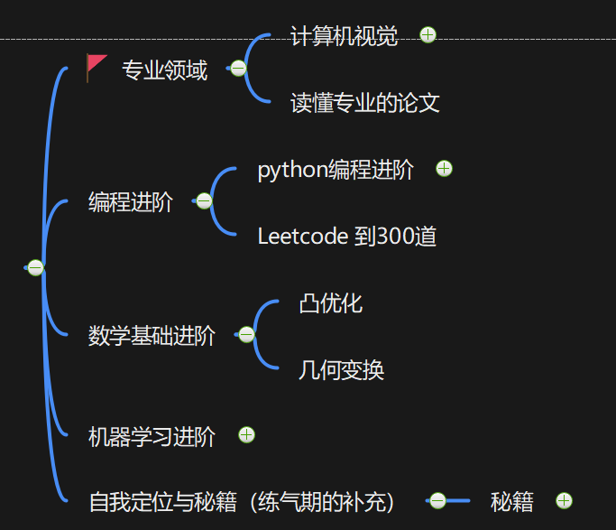
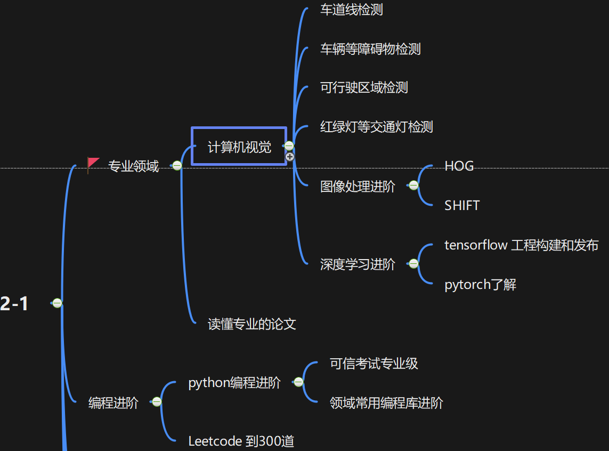
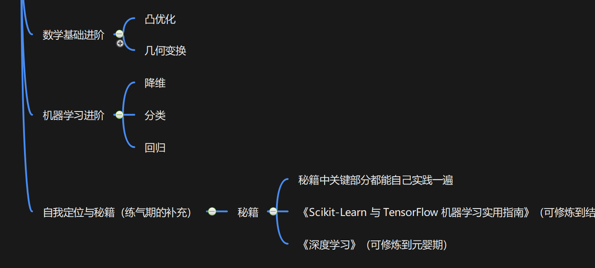

> 凡人修仙之筑基期：
>
> 1. 掌握计算机视觉中深度学习的基本知识，能够使用Tensorfow/pyTorch等对目标分类或者检测算法进行工程化；
> 2. 掌握Python/C++,能够熟练使用Opencv等视觉算法库；
> 3. 具备良好的数学能力，熟悉几何、统计和机器学习算法与理论等；
> 4. 跟踪业界的发展，能够顺畅地读写英文论文和文档；
>
> 对应公司职级：助理工程师 阿里 P5，华为15

### 总体路线

[我的专栏Github](https://github.com/sunrong1/self-driving)，可以看到整体的完整版本。

#### 总体目标

复现算法后，能够理解整个算法模型，进行初步的模型优化。

### 详细路线规划

熟悉数字图像处理的基本算法，如图像平滑滤波、图像金字塔、图像形态学、阈值化、边缘检测、直方图均衡与匹配、傅里叶变化及频域分析。

 掌握基本的机器学习算法：SVM支持向量机、BP神经网络、朴素贝叶斯分类、K均值聚类、决策树、Boosting

面对筑基期，我推荐的除了练气期的基本经典，还有其他更深的数据集，在百度或者微信读书上基本都可以找到，很多秘籍都是可以长期修炼的，我也经常看B站上也有好多优秀的资源。

### 小白的专栏

有疑问或者不对的地方，欢迎道友讨论交流，前辈传授经验。

- [我的专栏Github](https://github.com/sunrong1/self-driving)

- 我的知乎专栏：[自动驾驶之计算机视觉方向化神级修炼](https://www.zhihu.com/column/c_1407110076645273600)

